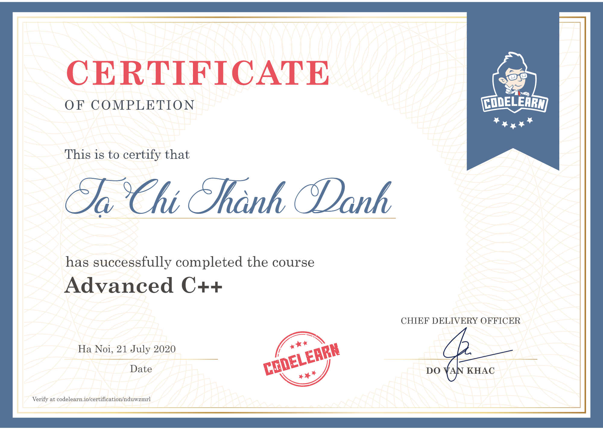

# General Information

Course name: Advanced C++.\
Course start date: 20th July, 2020.\
Course completion date: 21st July, 2020.\
Course link: https://codelearn.io/learning/cpp-advanced \
Certificate: https://codelearn.io/certification/nduwzmrl

# Description

This is my second course on **Codelearn.io**. I completed it in only **two days**.

# Certificate

