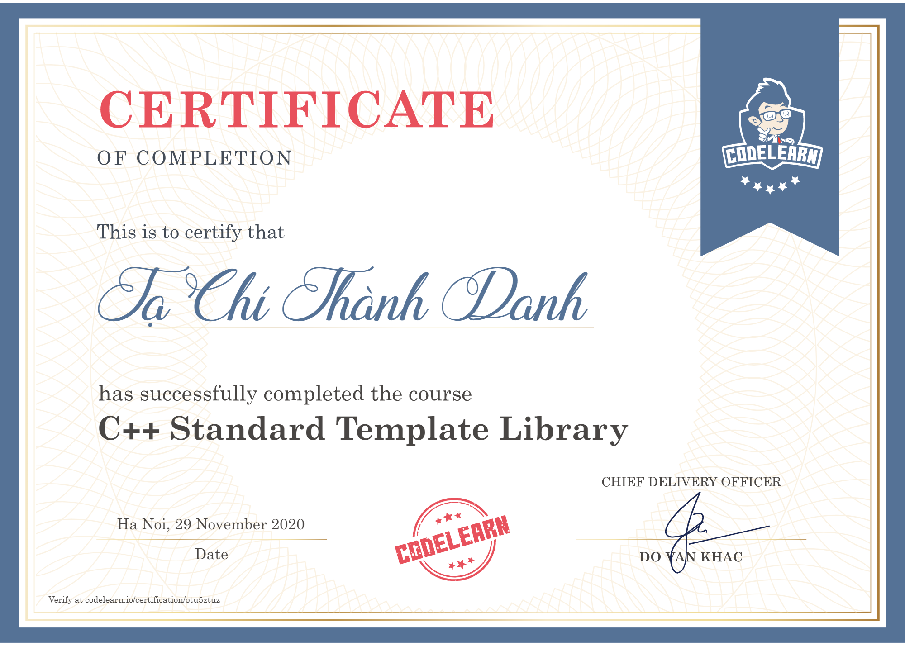

# General Information

Course name: C++ Standard Template Library.\
Course start date: 28th July, 2020.\
Course completion date: 29th November, 2020.\
Course link: https://codelearn.io/learning/cpp-standard-template-library \
Certificate: https://codelearn.io/certification/otu5ztuz

# Description

This is my forth course on **Codelearn.io**. 

# Certificate

