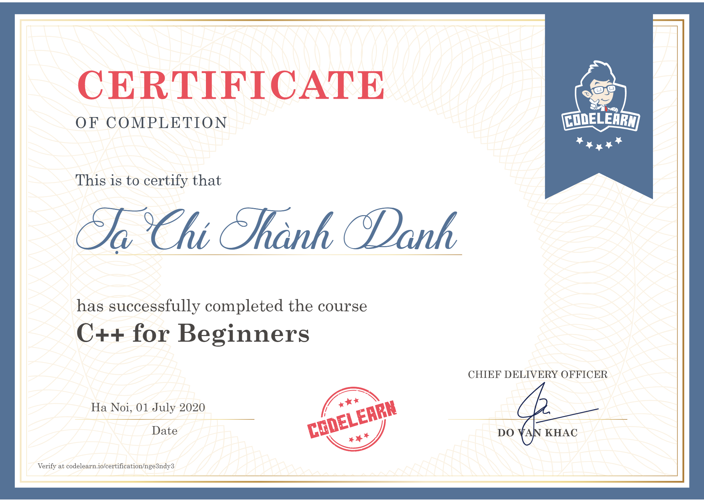

# General Information

Course name: C++ for Beginners.\
Course start date: 30th June, 2020.\
Course completion date: 1st July, 2020.\
Course link: https://codelearn.io/learning/cpp-for-beginners \
Certificate: https://codelearn.io/certification/nge3ndy3

# Description

This is my first ever course on **Codelearn.io**. I remember that I took this course after I had read several lessons on **[daynhauhoc C++ series](cpp.daynhauhoc.com)**.

An interesting fact about this course is that I completed it in only **two days**. What an impressive amount of time!!

Here are [the link](https://codelearn.io/learning/cpp-for-beginners) and [my certificate](https://codelearn.io/certification/nge3ndy3) for this course.

# Certificate

