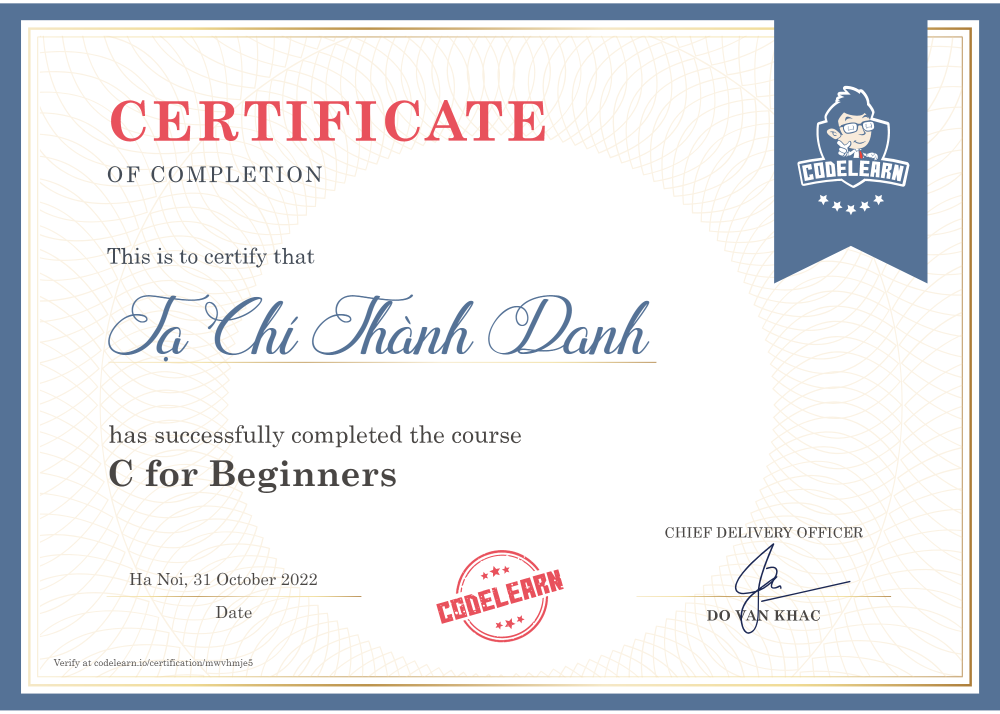

# General Information

Course name: C for Beginners.\
Course start date: 14th October, 2022.\
Course completion date: 31st October, 2022.\
Course link: https://codelearn.io/learning/c-for-beginners \
Certificate: https://codelearn.io/certification/mwvhmje5

# Description

This is the course that I enrolled in to supplement the corresponding knowledge for the Introudction To Programming course (CSC10001) in HCMUS. 

I took this class because the teacher taught us to write program in C programming language (though he permitted to use C++ too). Therefore, I decided to learn C basic syntax an practice my coding skills this particular course.

The course was effortless. However, I was busy doing my school assignments so I didn't complete the course as fast like past courses.
 

# Certificate

